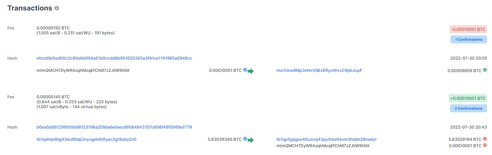

# Gerador de carteiras utilizando JS
Projeto sem frotend..
Criando e utilizando a **carteira de criptomoedas**.

Electrun testnet 4.2.2 (importar carteira gerada)
Bitcoin Faucet Generator (criptomoedas de teste) receber e enviar criptomoedas

#### NODE JS > Electrun > Blocks

##### **Para iniciar o projeto**: npm init -y 
##### **Dependencias**: - npm i bit39 bit32@2.0.6 bitcoin.js-lib --save

